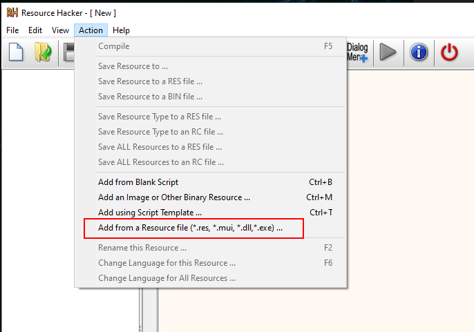
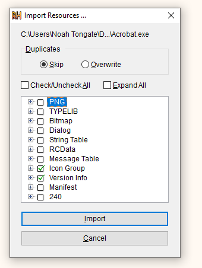
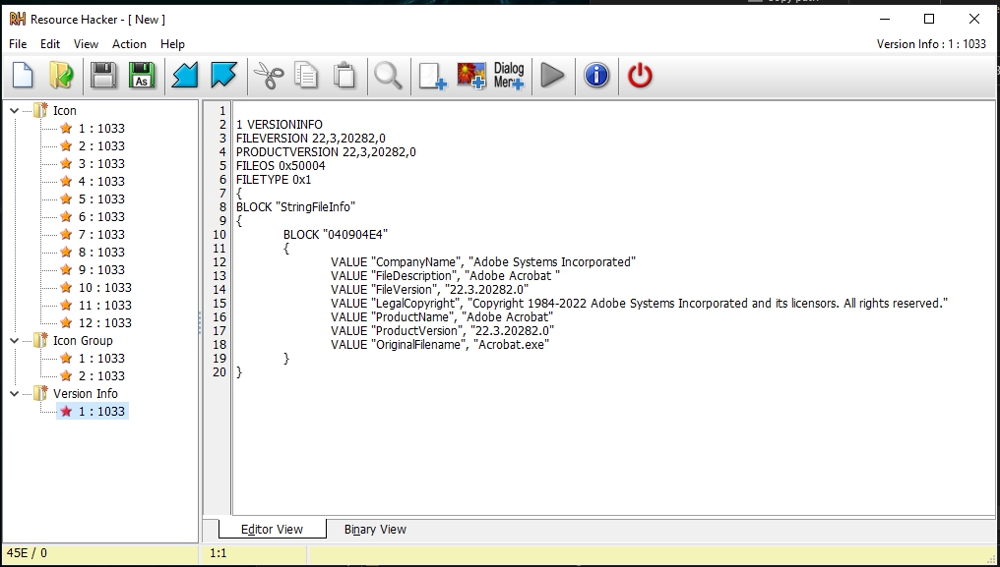
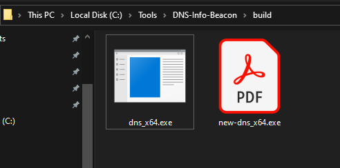

# Resource-Disguise

A repo containing some scripts for [Resource Hacker](http://angusj.com/resourcehacker/) that and an example `Makefile` for utilizing `windres`. This is an amazing GUI tool to extract/clone/decompile/edit/create resource file that can be used in payloads for offensive operations.

## Resource Hacker Scripts

### Scripts 
I have included two very simple example Resource Hacker scripts to clone Adobe Acrobat

- **extract.txt**: Opens a EXE, Logs Resource Hacker, and extracts a resource file
- **apply.txt**: Opens a supplied EXE, overwrites resources that are filter from provided resource file, and logs actions from Resource Hacker

### GUI 
1) Optional: We can either open our payload and add a resource file or we can clone a resource file from a legit EXE.

2) Open an EXE or DLL from the Action->"Add from Resource file"


3) Select the information from the resource file you want to include. In this example we are just saving the icon and version info.


4) Now that we have imported this we can edit the version info or we can keep it the same to clone a EXE


5) Once this is done save the current info to a resource file (.res). Now we have successfully extracted the info we want. If in step one you opened the EXE with no resources we can then save the current EXE with the resources already applied.


## Example Makefile or Command Line Use

### Example Makefile
At the top of my Makefile I used the following variables to specify the options and files being used

```shell
RC_x64		= x86_64-w64-mingw32-windres
RC_x86		= i686-w64-mingw32-windres
RES_FILE	= res/test.res 
RC_OPTIONS      = -O coff 
RC_OUTPUTFILE   = res/resource-info
```
Under my *make* header I used the following commands:

```shell
//x86_64-w64-mingw32-windres res/test.res -O coff -o res/resource-info_x64.rs
@$(RC_x64) $(RES_FILE) $(RC_OPTIONS) -o $(RC_OUTPUTFILE)_x64.rs

//x86_64-w64-mingw32-g++ main.cpp res/resource-info_x64.rs -lws2_32 -ldnsapi -o build/dns_x64.exe
@$(CC_x64) $(SOURCE) $(RC_OUTPUTFILE)_x64.rs $(OPTIONS) -o $(OUTPUTFILE)_x64.exe
@echo "Compiled x64 Successfully"
```

A modify version of the Makefile for my [Ap3x/DNS-Info-Beacon](https://github.com/Ap3x/DNS-Info-Beacon) is in this repos `MakeCLI` folder

### MinGW Command Line Use
In my development environment I linked the windres file so its easier to add resources manually.

```shell
sudo ln -s /usr/bin/x86_64-w64-mingw32-windres /usr/bin/windres-x64
sudo ln -s /usr/bin/i686-w64-mingw32-windres /usr/bin/windres-x86

windres-x64 res/test.res -O coff -o res/resource-info.rs
```

In the `windres` command above I used the *test.res* file from that I got cloning Adobe Acrobat EXE

## References
- [Resource Hacker](http://angusj.com/resourcehacker/)
- [Resource Hacker Tutorial](https://wexpert.webs.com/documents/Resouce%20hacker%20tutorial.pdf)